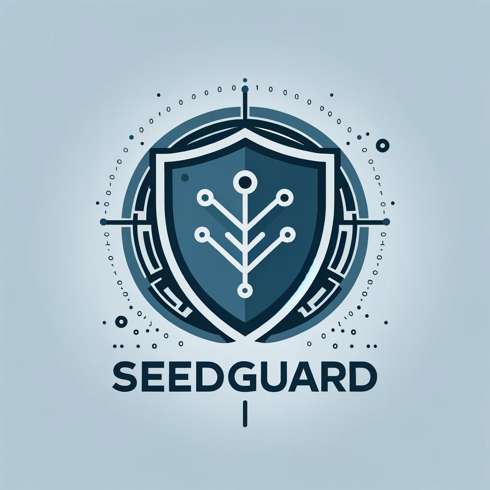
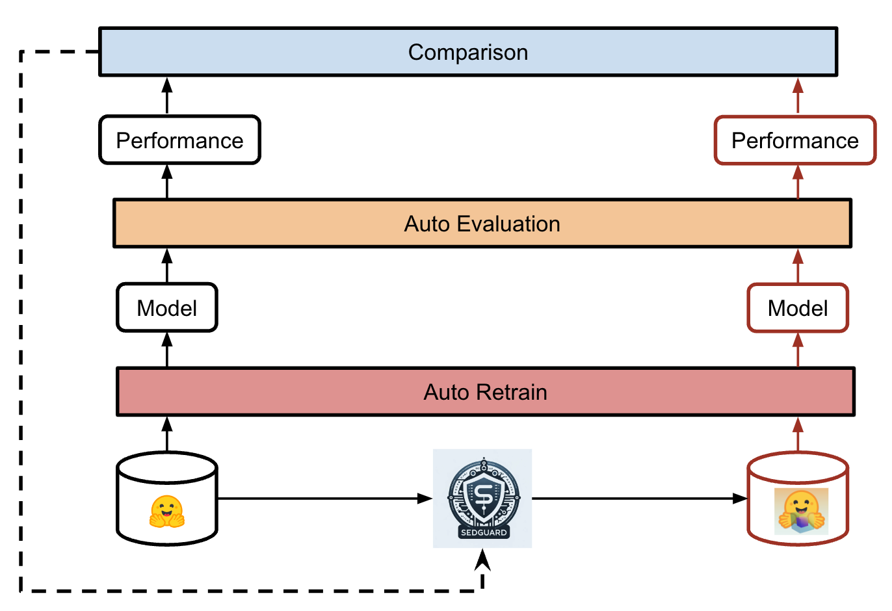

# SEEDGuard

> *It's impossible to have trustworthy AI without good data for AI models to learn.*

The vision of SEEDGuard is to provide a platform for researchers and practitioners to share and discuss data-centric methods for improving the quality of software engineering datasets.

## Table of Contents

- [SEEDGuard](#seedguard)
  - [Table of Contents](#table-of-contents)
  - [Introduction](#introduction)
  - [SE Data Quality Issues](#se-data-quality-issues)
  - [Contributing](#contributing)
  - [Contact](#contact)
  - [License](#license)

## Vision of SEEDGuard

The quality of software engineering datasets is crucial for the success of data-driven software engineering research. However, the quality of software engineering datasets is often overlooked.

In this project, we aim to develop a data-centric library for researchers and practitioners (especially LLM developers) for improving the quality of software engineering datasets.

Btw, SEEDGuard is short for **S**oftware **E**ngineering **E**mpirical **D**ata **Guard**.

## Workflow

The workflow of SEEDGuard is shown in the following figure:

## SE Data Quality Issues

Similar to the data in other domains, the data in software engineering also suffers from various quality issues. For example, limited high-quality labeled data, data privacy issues, data imbalance, etc. Moreover, SE data also has its own unique quality issues especially relate to code. For example, code used for training LLM can be poisoned to mislead developers to use insecure code.

We are actively expanding the list of SE data quality issues. If you have any suggestions, please feel free to open an issue or pull request. Currently, we mainly focus on the following SE data quality issues:

- SE Data Security
- SE Data Privacy
- SE Data Augmentation

## How to Contribute

We're excited that you're interested in contributing to SEEDGuard! This document outlines the process for contributing to our project. Your contributions can make a real difference, and we appreciate every effort you make to help improve this project.

We will be always happy to help for any problem or difficulties you may face during the contribution process.

## Getting Started

1. **Identify your target**

Based on your own interests, you may start in the following 2 different ways:

If you are interested in a specific dataset, your can:

- find the corresponding documentation about the dataset to know more about how the dataset was built
- based on your understanding, decide which data-centric method you want to apply on the dataset which will help to improve the dataset quality

If you are interested in a specific data-centric method, you can:

- identify a related research paper about a data-centric method which link to a specific data aspect (such as data security, data augementation) [Data-centric LLM4SE Paper Repo](https://github.com/SEEDGuard/Awesome-Data-centric-LLM4SE-Papers)
- find the specific dataset (with its documentations) mentioned in the paper

In short, at the end of this step, you should have a clear idea about:

- which dataset
- which data-centric method
- which data aspect
- how to evaluate the method

2. **Integrate the specifc data-centric method**

Once you manage to find a data-centric method fits your interests, you can either choose to reuse the replication package released by the original authors or implement the method by yourself. In both cases, you should be able to integrate the method into our project.

One important thing to note is that you should pack the method into a docker image. We provide a standard docker image template in the `docker` folder. You can find more details about how to build the docker image in the `docker` folder.

3. **Evaluate the method**

We provide a standard evaluation framework for evaluating the data-centric methods. You can find the evaluation framework in the `evaluation` folder. Please be aware that you need to standardize your input and output format by following the requirement of our evaluation framework.

## Contact

If you have any questions, please feel free to contact us via email [bxu22@ncsu.edu](bxu22@ncsu.edu) or open an issue.

## License

[MIT](LICENSE) © SEEDGuard
